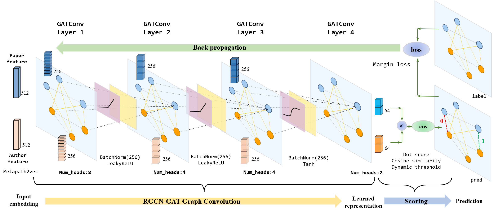

# Graph based Recommendation
Course project of SJTU CS3319: Data Science Fundamentals, 2023 spring.

### Task objective
Here is a link prediction problem in an academic network. We collected 6,611 authors and corresponding 79,937 papers from top journals in the field of GeoScience as well as citation information of their publications. The collected information is used to form an academic network, and there is a feasible way:

Build a heterogeneous network, which contains two types of nodes, one type of nodes represents authors, and the other represents papers. In this network, each edge between an author node and a paper node means that the authors have read the paper (connecting authors and the papers cited by the papers written by the authors), each edge between two author nodes denotes the co-authorship, and each directed edge between two paper nodes represents the citation relation.

This problem can be modelled as a link prediction problem, and your task is to predict each author-paper pairs in the test set based on the information provided. If the paper is recommended to the author, mark it as 1, otherwise mark it as 0.

For further information, see Kaggle competition [here](https://www.kaggle.com/competitions/cs3319-02-project-1-graph-based-recommendation).

### Designed network architecture


To address the issues, we propose a Graph Attention Network (GAT) based graph learning model that follows the Relational Graph Convolutional Network (RGCN) aggregation approach. Our designed model achieves an impressive F1-score of 0.9484 in the Kaggle competition, surpassing the majority of participating teams. [This report paper](report/Report_for_data_science_fundamentals.pdf) provides a comprehensive demonstration of the core architecture of our proposed method. Detailed implementation instructions are also disclosed for the purpose of reproducibility as a course project.

### Pretrained predictions
Several predictions with good performance submitted on Kaggle are put in [`pretrained_predictions`](pretrained_predictions). [`prediction_Final_0.94841.csv`](pretrained_predictions/prediction_Final_0.94841.csv) is the latest submitted version of our team.


### Run codes
Note that you may need to manually download the academic network dataset via [this link](https://drive.google.com/uc?id=1IGO3REgo88YHag3_yfftOIy8F5LTlhhA&export=download), unzip it and copy all files in `academic_network_data` to the empty directory `data`.

- Train model with tuned parameters on GPU (default:`cuda:0`)
```
python train.py --lr 2e-4 --wd 4e-4 --num_epochs 80
```

**Note:**
- `8GB` or more memory of GPU is preferred if you need to train the model yourself. Use `--batch_size` to adjust batch size and `--cuda -1` for CPU training. 
- It takes around `100-120` minutes to complete `80` training epochs on `2080Ti/3070Ti` GPUs with default settings.
- Best F1 scores during training may slightly vary among experiments. However, $0.943\pm 0.003$ F1 score should be reached to indicate a reliable execution.
- Predictions will be saved in `new_prediction`.